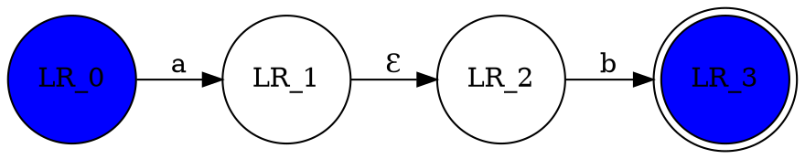
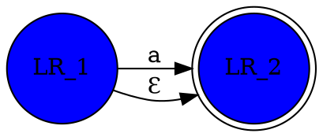
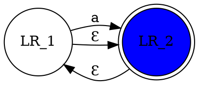
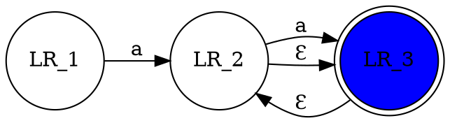
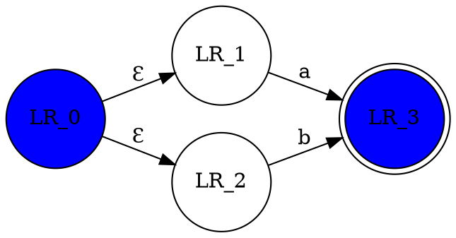
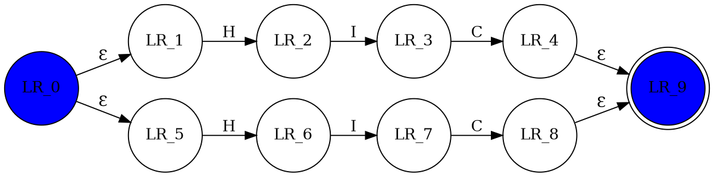
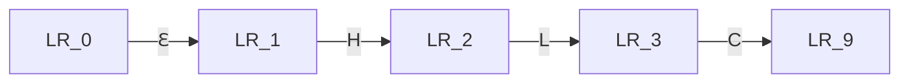

# 0x01 自动机基础

> 自动机是[有限状态机](https://baike.baidu.com/item/%E6%9C%89%E9%99%90%E7%8A%B6%E6%80%81%E6%9C%BA)(FSM)的数学模型。

> FSM 是给定符号输入，依据(可表达为一个表格的)转移函数“跳转”过一系列状态的一种机器。在常见的 FSM 的“Mealy”变体中，这个转移函数告诉自动机给定当前状态和当前字符的时候下一个状态是什么。

> 逐个读取输入中的符号，直到被完全耗尽(把它当作有一个字写在其上的[磁带](https://baike.baidu.com/item/%E7%A3%81%E5%B8%A6)，通过自动机的读磁头来读取它；磁头在磁带上前行移动，一次读一个符号)。一旦输入被耗尽，自动机被称为“停止”了。

> 依赖自动机停止时的状态，称呼这个自动机要么是“接受”要么“拒绝”这个输入。如果停止于“接受状态”，则自动机“接受”了这个字。在另一方面，如果它停止于“拒绝状态”，则这个字被“拒绝”。自动机接受的所有字的[集合](https://baike.baidu.com/item/%E9%9B%86%E5%90%88)被称为“这个自动机接受的语言”。

_以上引自`百度百科`词条[自动机](https://baike.baidu.com/item/%E8%87%AA%E5%8A%A8%E6%9C%BA/7444872?fr=aladdin)_

## [NFA](https://baike.baidu.com/item/%E4%B8%8D%E7%A1%AE%E5%AE%9A%E5%9E%8B%E6%9C%89%E7%A9%B7%E8%87%AA%E5%8A%A8%E6%9C%BA)与字符串匹配

### 字符串匹配过程

通常情况下，我们都会遇到需要进行字符串处理的工作。

例如，一个人力资源表格，我们要找到职级为e1,且曾经在HIC或LLC公司(字段名'company')供职的员工。

那么，我们可能会写出这么一段查询 `company in ('HIC' | 'LLC')`。

很显然，这里使用的匹配式子借用了正则表达式来表示。

那么，为什么我们需要借助正则表达式？它又和上面说的自动机理论有何瓜葛？

先喝口茶，且听我慢慢道来。

#### [正则表达式](https://baike.baidu.com/item/%E6%AD%A3%E5%88%99%E8%A1%A8%E8%BE%BE%E5%BC%8F)

正则表达式是用来描述某种`特定字符串模式`的形式语言。

通常来说，我们使用的正则表达式都需要回溯机制，因为通用型的正则引擎都需要处理分组捕获的问题。这个问题我们先按下不表，目前我们只考虑下文给出的5中基本模式。

* concat(`.`)

*下图表示`a.b`*

* option(`?`)

*下图表示``a?`*

- cleen(`*`)

_下图表示``a*`_

- onemore(`+`)

*下图表示``a+`*

* or(`|`)

下图表示`(a | b)`

#### 为什么需要NFA?

由上可知，如果我们要完成正则表达式所描述的模式匹配工作，则一定需要由某种机制来支持。如果，我们进一步将这个模式匹配的过程看作一个`停机接受`问题来处理的话。那么，我

们会发现将模式串视作一连串字符输入。同时，将待匹配字符串的每一个匹配结果视作一个状态。这里，我们将等待匹配开始计作开始状态`S`，

回到最初的问题匹配`('HIC' | 'LLC')`,实际就是如下的NFA接受带匹配串输入，最后判断是否`accept`的问题。

### NFA是什么？

言归正传，我们的目的是通过字符匹配过程理解NFA起的作用，以及NFA对于regex的一种表示。

从上文可知，NFA可以定义为如下的五元组$(\sum,Q,\delta_N,n_0,N_A)$。

其中$\sum$表示这个NFA能够接受的字母表,etc:'a','b','c'...'z'。

$Q$表示其中所有可达状态的集合，比如上图中的LR_0,LR_1..。

$\delta_N$表示所有可接受的状态转移的集合，比如图中➡️表示的信息。

$n_0$表示起始状态，任何状态机的起始状态都只有一个，如图中`LR_0`

$N_A$表示接受状态，这个状态可以有多个。它表示一个输入字符串是否匹配当前自动机所定义的语言。当输入串消耗完毕时，如果最后状态是接受。那么，我们说这个串符合当前自动机表示的正则表达式或者说符合某个字符串模式。如图中`LR_9`

### NFA ==? 匹配过程

如图所示，假定输入串为HLC.

## 参考资料

1. 《编译器设计》第二版
2. 《编译器设计基础》
3. 百度百科
4. 《语言与机器---计算机科学导论》
