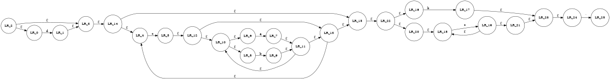
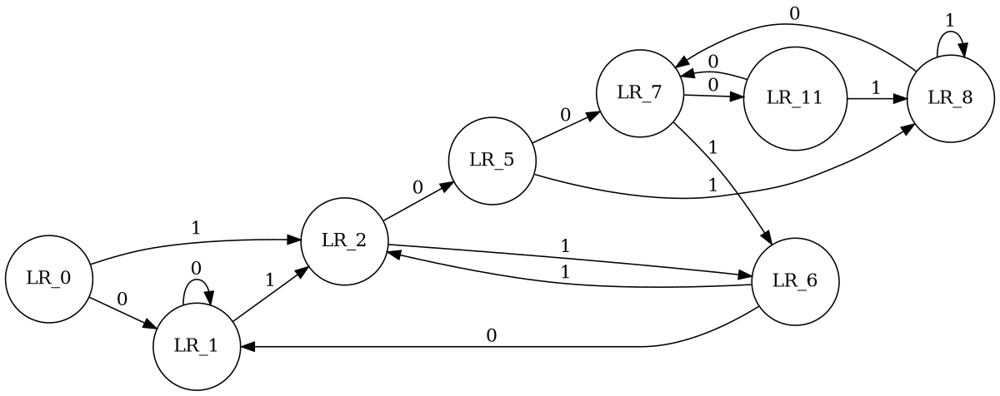

# 0x02自动机理论准备

书接上文，上回说道NFA已经可以完全描述正则语言的全部内容。那么，我们在这一章探索一下一个比较复杂的正则表达式在用NFA做匹配的时候会有什么“不足“。

## NFA匹配的"不足"

为了言之有物，不妨设要讨论的模式为`d?(c(a|b)*)*(b|c+)`

### 效率

从上图可以明确的看到存在大量的`ℇ`转换。这些`ℇ`转换在程序实现的时候就对应了大量的回溯入口，即决策点。那么很显然，这个时候一定存在大量的递归回溯调用，自然也就必然会需要

大量时间来执行。

#### `ℇ`转换冗余

究其原因，无非就是冗余状态太多了

### 冗余 ≠ 无用

这些看似冗余的转换实际上对[分组捕获](https://zhuanlan.zhihu.com/p/83876910#)非常有用,因为在分组捕获时，这些回溯可以记录当前匹配的状态还有剩余输入信息等。但是，如果我们不用分组捕获，只是要求模式全称匹配，则这些转换就是冗余的，我们需要通过`状态压缩`来实现确定化以避免任何回溯。

### 状态压缩

从上可知，若要完成状态压缩，则必须消除这些`ℇ转换`。但是，如何完成这一算法呢？完成后的确定化的结果仍然自动机么？当然是，并且它有个与`NFA`对应的名字叫做`DFA`。

## DFA登场

### DFA与NFA的区别

#### ℇ转换

### closure---闭包算法

#### 消除ℇ转换

### Subset-Construction(子集构造）

### Minimize DFA(Hopcraft Algorithm)
