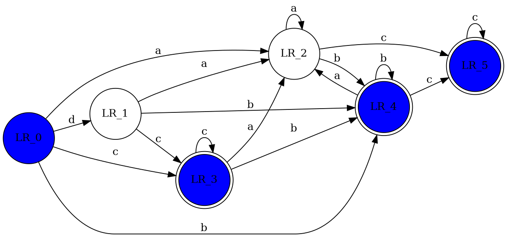

# Minimize DFA(Hopcraft Algorithm)

到这一篇文章为止，关于自动机在正则串匹配中的基本理论知识，已经大致结束。

本篇将专注最后一个问题，也是基于效率的考察，即前文变化得到的DFA还能不能再压缩？

## 等价状态

考虑DFA的压缩，自然少不了等价状态的帮助。因为只有找到可以视作等价的状态集合，

我们才能安心地减少现存状态，并不惧怕错误匹配的产生。

在NFA到DFA中，我们看到过基于`ℇ转换`的等价集合查找与合并。

类比此过程，我们也可在DFA最小化问题中找到类似定义。

### 等价划分

$$
设M=(Q,\sum,\delta,q_0,F)是DFA。如果对于每一个 u \in \sum^*,\delta(q_i,u)\in F\\当且仅当\delta(q_j,u)\in F，那么，状态q_i和q_j等价。

$$

#### 可区分

在这里我们要引入一个别名来表示等价的集合，即可区分。

从上面的定义可知，对于等价的状态他们就是可区分的。

基于上面的定义，我们可以勾出如下构造过程来实现等价划分。

1. 定义D(i,j)表示任意两个不同状态$q_i,q_j 且 i < j$。如果D(i,j) = 1,则$q_i,q_j是可区分的$

