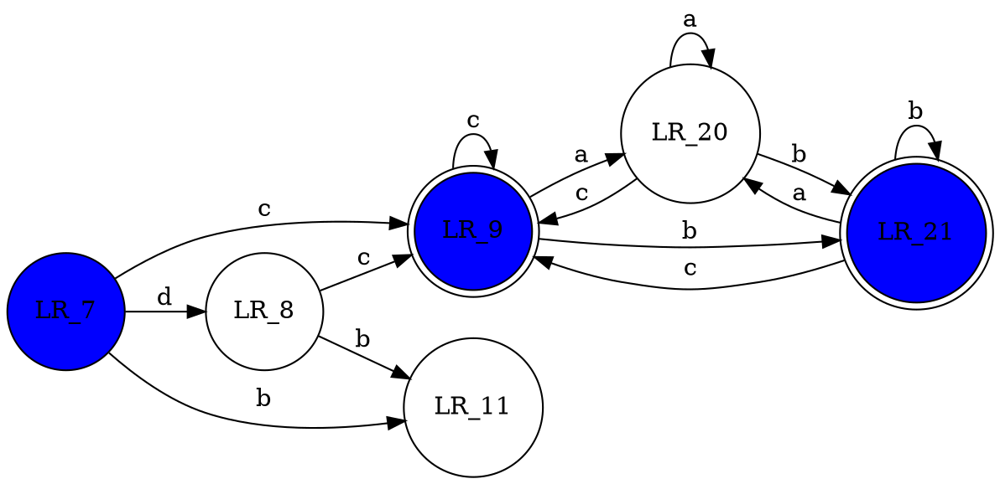

```graphviz
digraph G {
rankdir = LR;
size = "8,5";
node [shape=circle];
LR_7 [style=filled,fillcolor = blue]
LR_7 -> LR_8 [label="d"];
LR_7 -> LR_9 [label="c"];
LR_7 -> LR_11 [label="b"];
LR_8 -> LR_9 [label="c"];
LR_8 -> LR_11 [label="b"];
LR_9 [shape=doublecircle,style=filled,fillcolor = blue];
LR_9 -> LR_9 [label="c"];
LR_9 -> LR_20 [label="a"];
LR_9 -> LR_21 [label="b"];
LR_20 -> LR_9 [label="c"];
LR_20 -> LR_20 [label="a"];
LR_20 -> LR_21 [label="b"];
LR_21 [shape=doublecircle,style=filled,fillcolor = blue];
LR_21 -> LR_9 [label="c"];
LR_21 -> LR_20 [label="a"];
LR_21 -> LR_21 [label="b"];

}
```
